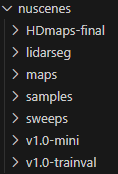

# Simple-BEV with Enhanced Commentary

## Overview

This repository is an enhanced version of the official implementation of **Simple-BEV**, a state-of-the-art model for Bird's Eye View (BEV) representation from multi-view images, as described in the paper [Simple-BEV: What Really Matters for Multi-Sensor BEV Perception?](https://arxiv.org/abs/2206.07959).


## Modifications

- **Comments and Explanations:** Added detailed comments across the important code, explaining the functionality, purpose, and thought process behind each section of the code.
- **Readability Improvements:** Minor adjustments to code formatting and structure to enhance readability.
- **Errors due to version disparity:** Due to some errors because of the version disparity, I made changes to some part of the code.

## Setup
First, run the code below step by step.  
Btw, the version of python that I used was `3.10.14`  
You can also choose your own conda environment name.  
```
conda create -n hj_simplebev
conda activate hj_simplebev
git clone https://github.com/parkie0517/Simple-BEV-with-Enhanced-Commentary.git
conda install pytorch=1.12.0 torchvision=0.13.0 cudatoolkit=11.3 -c pytorch
```
Now, let's check for CUDA availability.  
Change the directory to the clonned repository.  
Run the code below by specifying the number of the gpu using the `-n` argument.  
If you are running on a single gpu, run the code without any arguments.  
```
python ./test_cuda.py -n 3
```
Now, run the rest of the code below.  
```
conda install pip
pip install -r requirements.txt
```
Now, download the `nuScenes` dataset from this [link](https://www.nuscenes.org/download).  
After downloading the dataset, make sure that the structure of the dataset folder looks the same as the image below.    
  

Now, download the pre-trained RGB model.  
```
sh get_rgb_model.sh
```
If you want to use the RGB + Radar model, use the code below.  
```
sh get_rad_model.sh
```
After you execute the shell script, `./checkpoints` folder will be automatically created.  
And the saved model will be downloaded in the folder.  


## Evaluation
If you want to evaluate the RGB model, use the code below.  
```
sh eval_hj.sh
```